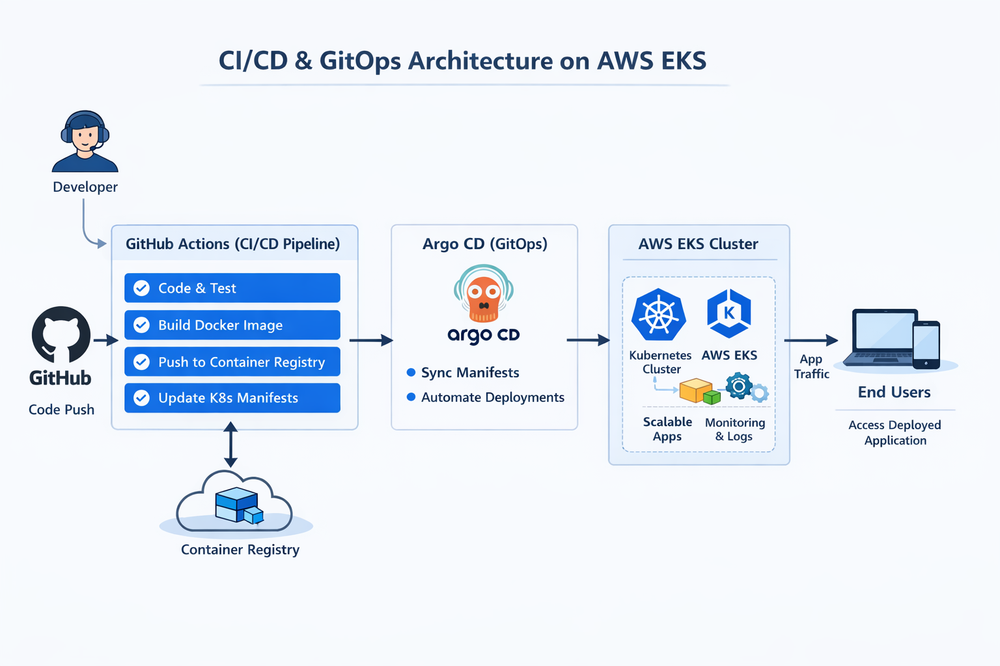

# 🚀 Full DevOps Lifecycle — CI/CD + GitOps + AWS EKS

This repository demonstrates a **fully automated DevOps pipeline** — from source code to cloud deployment — using industry-leading tools:

✔ Docker & Containerization  
✔ GitHub Actions (CI/CD)  
✔ Kubernetes manifests & Helm  
✔ AWS EKS (managed Kubernetes)  
✔ Argo CD (GitOps continuous delivery)  
✔ Automated environment deployment & monitoring

👇 Scroll down for architecture diagrams, workflow visuals, and step-by-step explanations.

---

## 🧠 Project Overview

This project evolves a simple Go web application into a *production-ready, cloud-native service* by:

1. **Containerizing the application** with Docker  
2. **Building CI workflows** in GitHub Actions  
3. **Deploying manifest files to EKS**  
4. **Syncing deployments via Argo CD** (GitOps)  
5. **Managing infrastructure as code**  
6. **Visualizing deployments with dashboards and logs**

---

## 📊 Architecture Diagram

  

This architecture demonstrates a production-grade CI/CD + GitOps workflow using:
- GitHub Actions for CI
- Docker for containerization
- Argo CD for GitOps deployment
- AWS EKS for managed Kubernetes

## 📦 Docker & Containerization

- Multi-stage Docker build
- Minimal base image
- Non-root user (if implemented)
- Optimized layer caching
- Production-ready image

## 🔄 CI/CD Workflow – GitHub Actions

On every push to `main` branch:

1. Run unit tests
2. Build Docker image
3. Tag image with commit SHA
4. Push image to container registry
5. Update Kubernetes manifests
6. Commit updated image tag to GitOps repo

## ☸ Kubernetes Architecture

Resources used:
- Deployment
- Service (ClusterIP / LoadBalancer)
- Ingress
- ConfigMaps
- Secrets

## 🤖 GitOps Workflow (Argo CD)

Argo CD continuously monitors the Kubernetes manifests repository and ensures:

- Desired state matches cluster state
- Automatic sync on changes
- Self-healing if drift occurs

## ☁ AWS EKS Infrastructure

- Managed Kubernetes Control Plane
- Worker Nodes (EC2)
- VPC networking
- IAM Roles for Service Accounts
- Load Balancer integration

## 🧠 What This Project Demonstrates

✔ End-to-end DevOps lifecycle  
✔ CI automation  
✔ GitOps delivery model  
✔ Kubernetes production deployment  
✔ Cloud-native architecture design  
✔ Infrastructure thinking beyond code
